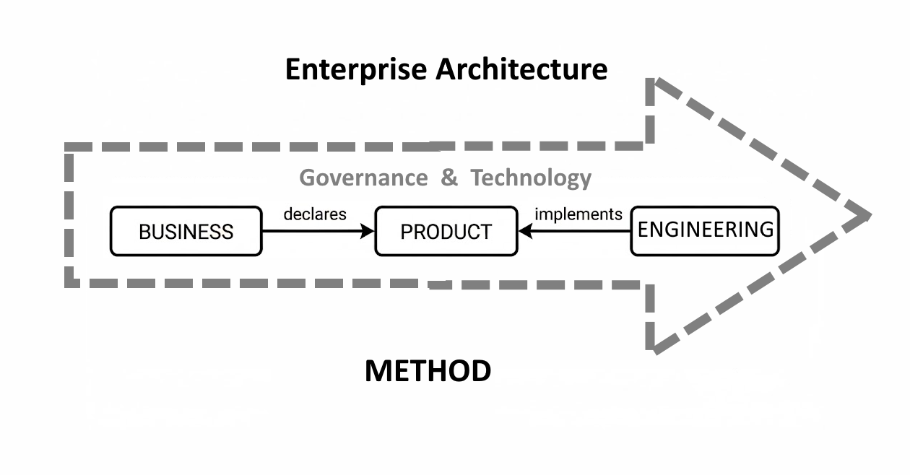

# The Loop

### Business Process Technology (BPT) 

>**Tip**
>
>Continuous Product Centric Cycle
{: tip}

This diagram represents **Enterprise Architecture role as the governing meta-layer** that orchestrates the Business-Product-Technology relationship through continuous cycles (loops).

Irone Code Labs is, delivery focused, operational methodology for CMM-ready organisations. EA is the **governor** — it does not participate in the loop, it governs it.

Activities are communication protocols informing on the intent. They are simple and clean and make possible keeping the 3 parts decoupled, but delivering as a whole. Again under the central authority of the Enterprise Architecture firmly eastablished in clients organization

| Activity Protocol | The Intent | Key actors |
|----------|-------------|------------|
| **Require** | Business declares product needs; EA ensures alignment with strategy | Business, EA |
| **Develop** | Technology builds to product specifications; EA governs coherence | Technology, Product, EA |
| **Deploy** | Product is released into operations; EA validates architecture compliance | Technology, Product, EA |
| **Evaluate** | Measure outcomes against business objectives; feed back into next cycle | Business, Product, EA |

Evaluate feeds back to Business so that next Require can commence— the loop never stops.

#### Roles, Actors and Scope

Different roles and actors work inside different parts of the loop. That fact defines the scope of each role.

| Roles | Scope | Activities |
|-------|-------|------------|
| Business Leaders, Clients, Product Owners, BAs | **Business** | declares products, owns outcomes |
| Product Owners, QAs, BAs| **Product** | bridges business needs and technical capabilities (the alignment point) |
| Engineers, Developers, DevOPs| **Technology** | implements products |
| Enterprise Architects | **Organization** | overarching role whose scope is company-wide; governs the meta-layer, guides all transitions without bottlenecking |

BA == Business Analyst
QA == Quality Assurance

> **Note**
> 
> **Key strengths:**
>
> - Product is the natural alignment point between Business and Technology
> - Architecture operates "above" the process, not within it
> - [CMM](cmm.md) prerequisite filters out organizations lacking foundational maturity
> - Continuous loop maps to operational rhythm, not rigid phase gates
{: .note}

## Enterprise Architecture role
- Defines principles that guide all four transitions (Require/Develop/Deploy/Evaluate)
- Ensures Product decisions maintain Business-Technology coherence
- Governs without bottlenecking the cycle
- Measures alignment health through evaluation feedback

## This works because:
- Organizations at sufficient CMM level have implicit governance structures
- Product management becomes the **operational manifestation** of architecture
- The loop tests architecture decisions against reality continuously
- Answer to a difficult question: "Is Business aligned with Technology?", becomes measurable

**In TOGAF terms:** This is Architecture Governance as a productized execution model, not replacing TOGAF ADM but providing the operational CMM based framework ADM governs.

> **Tip**
> 
> **Product unifies; Loop validates.**
{: .tip}

---
Until further notice &copy; dbj@dbj.org
