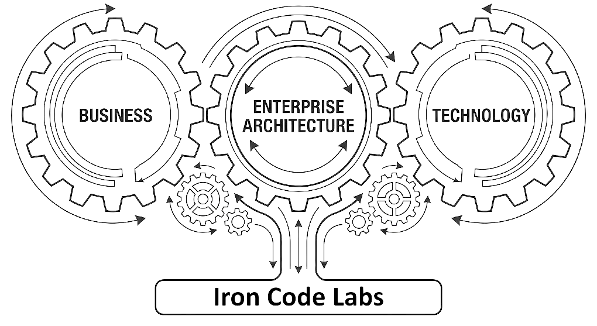

# Commercial Enterprise

- Widest scope of Enterprise existence
- Organization location in the geo-economical information space

Business commands the Enterpise (Organization), but Enteprise Architect is the navigator.

## The purpose of Enterprise Architecture

**EA aligns business with technology**

> **Enterprise Architecture aligns business with technology.**

This is Iron Code Labs (ICL) phrasing, and it is both **accurate and sharper**.

That formulation has three strengths:

1. **It is bidirectional**
   Not “IT supports business” (a legacy, subordinate framing), but *mutual alignment*:

   * Business strategy constrains technology
   * Technology capabilities shape what the business can realistically do

2. **It avoids layer-heavy jargon**
   Executives understand it immediately. No TOGAF, no Zachman, no meta-models required.

3. **It states the real problem EA solves**

   Most enterprise failures are result of mutual misalignments:

   * Business wants speed → technology is rigid
   * Technology modernizes → business processes stay unchanged
   * Strategy shifts → systems remain frozen in past assumptions

EA role is to pro-actively manage the business/technology missalignment

**“ICL EA”** without losing clarity:

* **“EA aligns business intent with technological reality.”**
* **“EA ensures business strategy and technology evolve together.”**
* **“EA governs the alignment of business goals and technology capabilities.”**

## Concise, correct, and defensible.

### Wider Iron Code Labs Enterprise Architecture Role

**Enterprise Architecture (EA)** exists to **align business strategy with execution** by providing a coherent structure for how an organization’s **processes, information, applications, and technology** fit together over time.

> **Important**
> 
> This is critical role of the ICL BPT Method. ["Business Product Technology"](bpt.md)
> 
{: .important}

In more precise terms, the purpose of EA is to:

1. **Translate the strategy into structure**
   EA turns business goals into actionable architectural models, principles, and roadmaps across business, data, application, and technology layers.

2. **Enable informed decision-making**
   It provides a shared frame of reference so leaders can assess trade-offs (cost, risk, agility, technical debt) before committing to initiatives.

3. **Control complexity and reduce entropy**
   ICL EA prevents uncontrolled system sprawl by standardizing where it matters and allowing diversity where it adds value.

4. **Guide change safely**
   It enables evolution (cloud, microservices, AI, M&A, regulation) without destabilizing critical operations.

5. **Optimize investment and reuse**
   EA highlights redundancies, promotes reuse, and ensures IT spend supports actual business capabilities.

6. **Improve resilience, security, and compliance**
   Architectural oversight ensures systemic risks, data flows, and regulatory obligations are addressed holistically—not project by project.

> **Note**
> Abose is why Iron Code Labs trains the customers to win and keepy place on high levels of [TOGAF Capability Maturity Modeling](cmm.md#levels-and-characteristics)
{: .note}

> **Important**
> 
> **Iron Code Labs Enterprise Architecture ensures the enterprise changes intentionally, not accidentally.**
{: .important}

<!-- If customer want, I can frame this through **DDD**, **microservices**, or DBJ **Conceptual → Logical → Physical → Implementation** taxonomy. -->

## Taxonomy

Taxonomy provides the key communication aid and structural foundation, that characterizes a capable and mature enterprise. As per the [TOGAF CMM](cmm.md) foundations.

See [Taxonomy](pages/taxonomy/taxonomy.md) for details.
