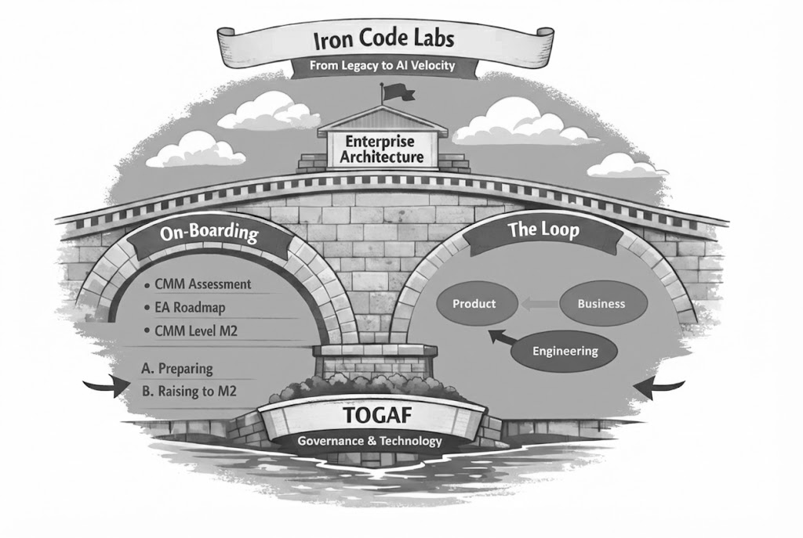

*Back to [IRONCODELABS.COM](https://ironcodelabs.com)*

### This Method exists because of AI

#### [ICL AI Guidance](ai.md)

<!-- Each ICL Client Team Member has a role defined by the ICL Method and can use the LLM to help create the results. But here is the key:

**Accountability stays with the person, not the AI tool**

- ICL guiding principle is to understand why, how and were, our customers use the AI tool of choice
- If things go wrong we do not blame it on AI
- AI is a marketing term — LLM is engineering
- We do not blame it on the LLM -->

# Iron Code Labs Method

<!--  -->

<!--  -->

<!-- The Iron Code Labs (ICL) method is composed of two stages: **On-boarding** and **The Loop**. -->
#### The Iron Code Labs (ICL) method is a bridge of two arches: **On-boarding** and **The Loop**.

>**Important**
>
> ICL enables clients with [Enterprise Architecture](enterprise_architecture.md) as the overarching framework supporting and driving the whole process. ICL EA is based on solid [TOGAF](https://www.opengroup.org/togaf) foundations.
{: important}

## Stage 1 — On-boarding

In this step ICL prepares clients for EA architecture-led delivery by putting them on the firm [capability maturity foundations](cmm.md#diagram).

### A — Preparing for the [CMM Levels](cmm.md#levels-and-characteristics)

ICL EA leads the assessment of the client's current organisational maturity levels using the ACMM Levels [M0–M5](cmm.md#levels-and-characteristics) nomenclature. In this step ICL EA:

- Introduces key communications aid: common vocabulary defined as Technology Landscape Classification aka [Taxonomy](taxonomy.md)
- Identifies capability gaps using the ACMM scorecard
- Sets a realistic target level (typically M2)

**Deliverables:** ACMM baseline assessment + EA-guided improvement roadmap

### B — Raising the Organisation to CMM Level M2

ICL EA defines and documents architecture processes — moving the organisation from ad-hoc (M1) to defined (M2).

- Establishes governance structures and secures senior management involvement
- Introduces architecture-driven communication practices across the organisation
- Introduces the common, simple but powerful [Taxonomy](taxonomy.md) as a key organisational asset

**Deliverable:** organisation operating at CMM level M2 with EA-documented processes

For full detail on the maturity model see [CMM](cmm.md).

## Stage 2 — [Business, Product, Technology](bpt.md) Loop

**Continuous operational cycle, company-wide**

Once on-boarded, the client organisation enters the **BPT Loop** — a continuous cycle of three clearly decoupled parts: **Business**, **Product** and **Technology**. This is Iron Code Labs' delivery-focused operational methodology for CMM-ready organisations. EA is the **meta-layer** — it does not participate in the loop, it governs it.

---
Subject to change, material in this site is &copy; dbj@dbj.org , CC BY SA 4.0
