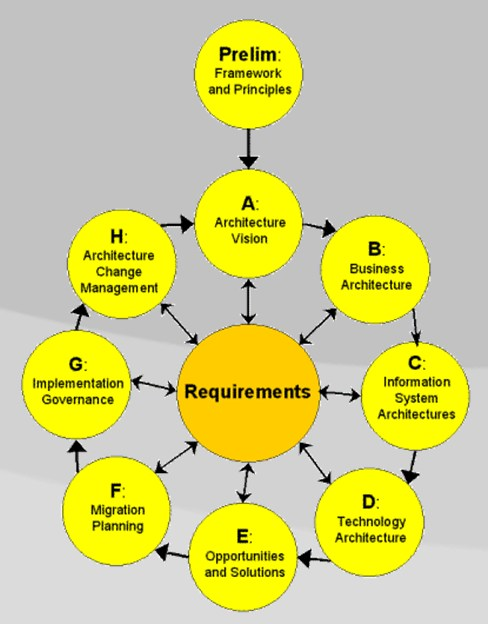

# LLM Adoption Decision Model — The 4-Level Test

Before approving LLM use in any project, run it through four questions — one per architectural level. All four must pass. One failure means the LLM does not belong there.

The four levels come directly from the [ICL Enterprise Taxonomy](https://ea.ironcodelabs.com/taxonomy.html): Conceptual, Logical, Physical, Implementation. The taxonomy defines what each level is responsible for. This model applies that structure to the LLM adoption decision.

---

## Level 1 — Business Capability (Conceptual)

**Does the problem actually need language reasoning?**

LLM fits when the capability requires:

- Understanding unstructured text
- Contextual or fuzzy reasoning
- Synthesizing knowledge from many sources
- Handling ambiguous intent

LLM does not fit when the capability is:

- Rule execution
- Data transformation
- Structured workflow
- Search or lookup

**Decision rule:** If you can write the business rules down exhaustively — do not use an LLM.

---

## Level 2 — Service Design (Logical)

**Is the LLM a contained service, or is it taking over?**

Acceptable:

- LLM is one bounded service with a defined input and output
- Its results are measurable (accuracy, error rate, user acceptance)

Not acceptable:

- LLM as the orchestrator of other services
- LLM as the "brain" that coordinates cross-domain decisions
- LLM as the source of business truth

**Decision rule:** LLM is a specialist, not a manager.

---

## Level 3 — Operations (Physical)

**Can you run this in production without surprises?**

You must have answers to:

- What is the monthly cost and how does it scale?
- What is the acceptable response time?
- What happens when the LLM fails or returns bad output?
- Who monitors it and how?

**Decision rule:** No LLM in production without a defined cost ceiling, SLA, and fallback path.

---

## Level 4 — Implementation (Implementation)

**Can you remove or replace the LLM without rewriting the system?**

Required:

- Model can be swapped (no vendor lock baked into domain logic)
- Business rules live in code, not in prompts
- A clear boundary separates the LLM from the rest of the system

**Decision rule:** If pulling out the LLM would collapse the architecture, it was overengineered.

---

## Summary

LLM is the right choice only when all four conditions are met:

| Taxonomy Level | Decision Level | Condition |
|---|---|---|
| Conceptual | Business Capability | Semantic reasoning is genuinely required |
| Logical | Service Design | LLM is a bounded, replaceable service |
| Physical | Operations | Cost, SLA, and failure paths are defined |
| Implementation | Implementation | Clean boundary, no logic hidden in prompts |

One "no" anywhere — and you are building Fred Brooks' [second system](https://en.wikipedia.org/wiki/Second-system_effect).

---

### Reference

[Iron Code Labs Enterprise Taxonomy](https://ea.ironcodelabs.com/taxonomy.html)
