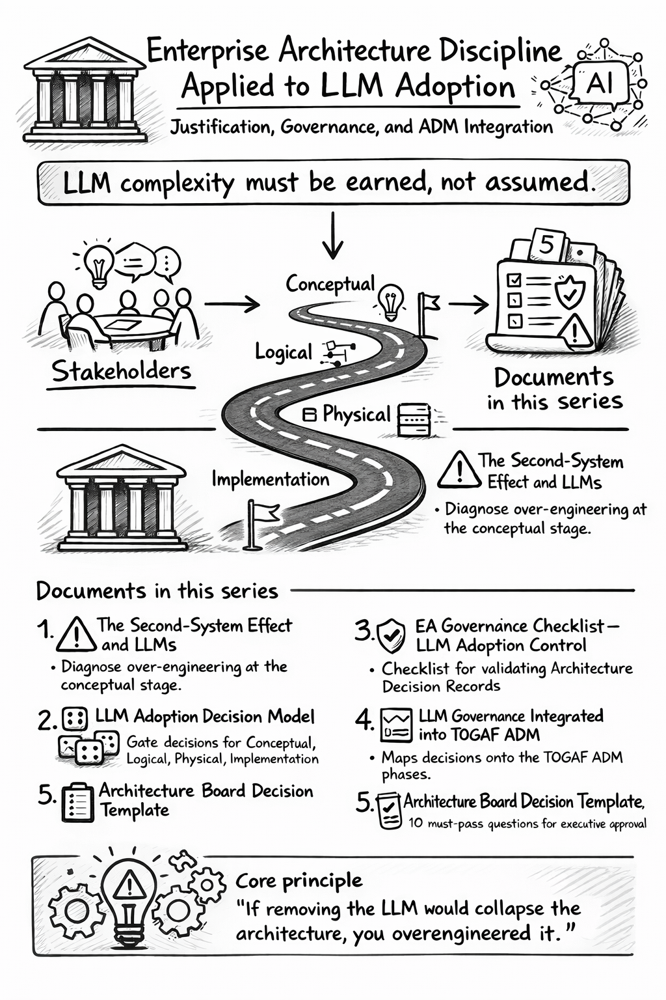

# LLM Adoption



> Enterprise architecture discipline applied to Large Language Model adoption — a structured series covering capability justification, governance, and ADM integration.
{: .note}

This is the root document for the LLM Adoption series. It explains the overall approach and points to the five documents that together form a complete governance framework for introducing Large Language Models into an organization.

**The central argument:** LLM complexity must be earned, not assumed. Each document applies the four-level taxonomy (Conceptual → Logical → Physical → Implementation) to keep AI adoption under architectural control.

## What problem does this series solve?

Organizations adopt LLMs in two ways. The first is disciplined: a specific business problem is identified, alternatives are evaluated, the LLM is scoped tightly, and governance ensures it stays that way. The second is accidental: a team adds an LLM because it seems useful, it grows, other teams copy the pattern, and within a year the organization is running an AI platform it never designed and cannot explain.

This series is a framework for doing it the first way.

It is grounded in two foundations:

- **[ICL Enterprise Taxonomy](https://ea.ironcodelabs.com/taxonomy.html)** — a four-level hierarchy (Conceptual, Logical, Physical, Implementation) that structures every architectural decision in the organization.
- **[TOGAF ADM](https://en.wikipedia.org/wiki/The_Open_Group_Architecture_Framework)** — the standard architecture lifecycle that defines how decisions are governed across phases of a project.

The framework does not invent a separate AI process. LLMs go through the same gates as any other architectural component — with additional checks for their specific failure modes.

---

## The five documents

### 1. [The Second-System Effect — Why LLM Adoption Fails](second-system-effect.md)

**Start here.** This document explains the core risk pattern: teams that adopt LLMs without constraints tend to build systems that are far larger and more complex than the problem required. Fred Brooks named this the Second-System Effect in 1975. It applies directly to AI adoption today.

> LLM should be a capability injection, not a platform foundation — unless the product itself is AI-native.

Read this first to understand *why* governance is necessary — not as policy, but as protection against a well-documented failure mode.

---

### 2. [LLM Adoption Decision Model — The 4-Level Test](decision-model.md)

**The decision framework.** Before any LLM is approved, it must pass four questions — one per taxonomy level. All four must pass. One failure means the LLM does not belong in that context.

| Level | Question |
|---|---|
| Conceptual | Does the business problem actually require language reasoning? |
| Logical | Is the LLM a bounded service — not an orchestrator or decision engine? |
| Physical | Is the system production-ready with defined cost, SLA, and fallback? |
| Implementation | Can the LLM be removed or swapped without rewriting domain logic? |

Use this document when a team is proposing LLM usage and you need a structured way to evaluate whether it is justified.

---

### 3. [EA Governance Checklist — LLM Adoption Control](governance-checklist.md)

**The working checklist.** This translates the 4-Level Decision Model into a concrete checklist that a team completes before bringing a proposal to the Architecture Board. Sixteen binary checks across all four levels. Every item must be answered "yes." Any failed gate means the proposal is rejected and must be redesigned.

This is the document a team fills out. It is the evidence that the four-level test was applied — not just considered.

---

### 4. [LLM Governance Integrated into TOGAF ADM](togaf-adm.md)

**The lifecycle integration.** This document maps LLM governance controls onto the standard TOGAF ADM phases — from Preliminary through Phase H. It shows where each check belongs in a real architecture engagement, without inventing a parallel process.

Use this document when planning or reviewing an architecture engagement that includes LLM components. It answers: at which phase does each governance action happen, and what deliverable is required as evidence?

---

### 5. [Architecture Board Decision Template — LLM Approval](board-decision-template.md)

**The formal approval gate.** This is the document the Architecture Board uses to record its decision. Ten yes/no questions — grouped by taxonomy level — must all be answered "yes" for approval. Any "no" requires redesign before resubmission.

The template also lists the supporting deliverables the team must have produced before presenting: written justification, a named KPI, a cost model, operational targets, and an architecture diagram.

---

## How the documents relate

```
1. Second-System Effect
   └── establishes WHY governance is needed

2. 4-Level Decision Model
   └── defines WHAT questions to ask

3. EA Governance Checklist
   └── is HOW a team applies the model before presenting

4. TOGAF ADM Integration
   └── shows WHERE each control sits in the architecture lifecycle

5. Architecture Board Template
   └── is the formal record of the board's decision
```

A team working through an LLM adoption moves through these in order: understand the risk (1), apply the decision model (2), complete the checklist (3), present at the right ADM phase (4), receive a board decision (5).

---

> If removing the LLM would collapse the architecture, you overengineered it.

*Reference: [Fred Brooks — Second-System Effect](https://en.wikipedia.org/wiki/Second-system_effect)*
