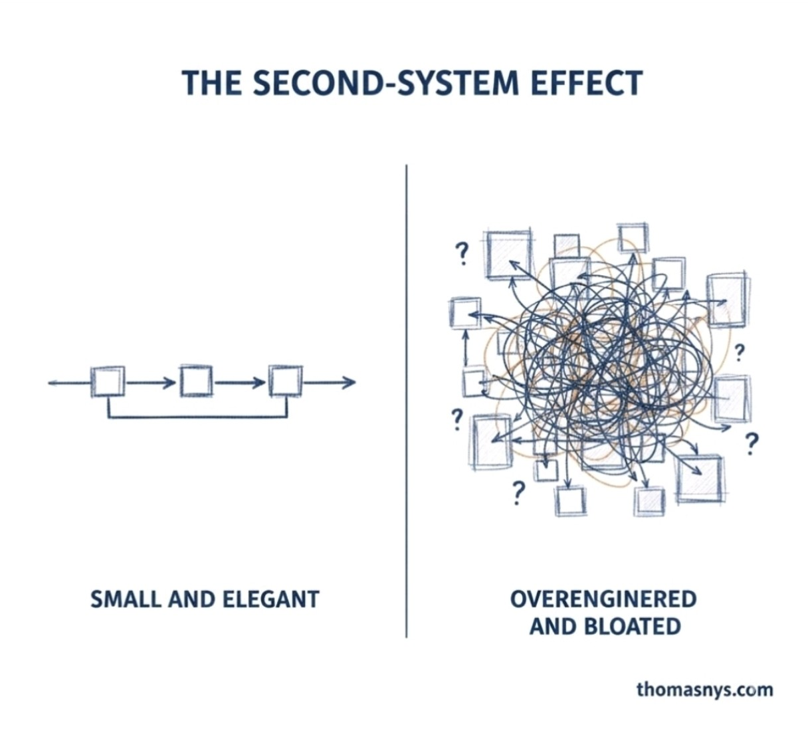

# LLM can lead to the Second-System Effect

The classic **[Second-System Effect](https://en.wikipedia.org/wiki/Second-system_effect)**. Concept was articulated by Fred Brooks in *The Mythical Man-Month* (1975):

> Fred Brooks: The second system a designer builds is the most dangerous.

### What it means

* **First system** → constrained, pragmatic, minimal.
* **Second system** → "now we know better" → feature accumulation → abstraction layers → generalization → complexity explosion.

The image captures that perfectly:

* Left: pipeline, bounded, coherent.
* Right: graph-theory nightmare.

---

## LLMs are complex and resource-heavy. Should that be avoided from the start?

Let's analyze precisely.

### 1. Complexity source

LLMs are inherently:

* Exponentially slower with longer inputs.
* GPU-bound
* Latency-sensitive
* Memory-intensive
* Operationally non-deterministic

This is not accidental complexity. It is **essential complexity** of the LLM.

So the question is not:

> "Are LLMs complex?"

They are. The question is:

> "Is the (business) problem space complex enough to justify that complexity?"

---

## Architectural Framing

When LLM is proposed as a solution, EA asks four questions — one per level:

* **Conceptual level** → What business capability is required?
* **Logical level** → What service pattern fulfills it?
* **Physical level** → What infrastructure hosts it?
* **Implementation level** → What concrete model / vendor?

If the required capability is any of:

* deterministic workflow
* structured data transformation
* rule evaluation
* search and retrieval

Then introducing an LLM is likely leading to **second-system overreach**. Its introduction will increase complexity, while the functionality can be solved with non-LLM tools.

If the required capability is any of:

* semantic inference
* unstructured reasoning
* language abstraction
* fuzzy decision support

Then LLM complexity may be justified. Pre-LLM tools and techniques would produce a more complex solution than an LLM-based one.

> Architectural Framing is not a cook-book recipe. It requires adequate business domain and LLM domain expertise.
{: .note}

---

## The Real Risk

The `second-system effect` with LLMs usually looks like:

1. An LLM is added "just in case."
2. Orchestration is built around it.
3. A vector DB is added.
4. RAG is added.
5. Prompt management is added.
6. Evaluation pipelines are added.
7. Guardrails are added.
8. A research lab is now owned.

That is the right side of the picture above — the graph-theory nightmare, not the clean pipeline. A system started as a required capability solution and became a platform. The architecture now carries LLM infrastructure, orchestration dependencies, and operational overhead that were never scoped, never justified, and never governed.

---

## Advisory to Avoid LLM Overengineering

If we want to avoid second-system syndrome with AI, we need to:

1. **Start with deterministic systems.**
   - If the problem can be solved with rules, workflows, or structured logic — solve it that way first.
2. Introduce LLM only for solving a single bounded well-understood capability requirement.
   - One problem, one justification, one integration point — not a general-purpose AI layer.
3. Keep it behind a narrow interface (anti-corruption layer).
   - The rest of the architecture should not know or care that an LLM is behind the interface.
4. Measure actual business delta.
   - Validate that the LLM produces measurable business value before expanding its scope.
5. Do not build an AI platform before proven need.
   - Platform investment follows proven capability — not the other way around.

In other words:

> LLM should be a capability injection, not a platform foundation — unless the product itself is AI-native. Which legacy business system never is.
{: .important}

---

## In a mature organization fighting legacy

Introducing LLM too early can:

* destabilize governance
  * LLM outputs are non-deterministic — existing approval, audit, and compliance processes are not designed for that.
* bypass architecture discipline
  * Teams integrate LLMs directly, skipping capability assessment, pattern selection, and review gates.
* create shadow IT
  * Business units procure LLM services independently, outside of architecture and security oversight.
* inflate infrastructure cost
  * GPU compute, vector storage, and API usage accumulate fast — often without a cost owner or budget line.

That is exactly how (Fred Brooks) second systems are born.

---

## Bottom Line

LLM complexity should not be avoided **by dogma**.
It should be avoided **until justified by capability gap**.

The mistake is not using LLMs. The mistake is:

> Building the second system before business-validating the first one.

---

*Reference: [Fred Brooks — Second-System Effect](https://en.wikipedia.org/wiki/Second-system_effect)*
