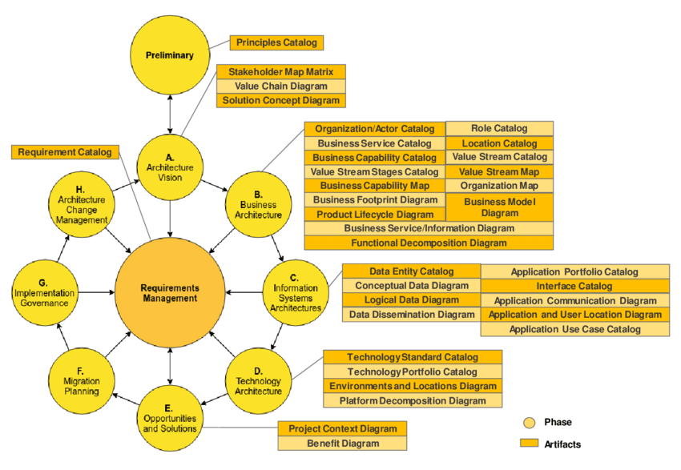

# LLM Governance Integrated into the ADM

The [TOGAF ADM](https://en.wikipedia.org/wiki/The_Open_Group_Architecture_Framework) gives us a structured cycle for architecture work. Each phase has a natural point where LLM governance decisions belong. This document shows where to insert those controls — without inventing a parallel process.

The rule is simple: LLM gets no special treatment. It goes through the same gates as any other architectural component — it just has additional failure modes that need to be explicitly addressed.

The checks in each phase map to the [ICL Enterprise Taxonomy](https://ea.ironcodelabs.com/taxonomy.html) levels: Conceptual (Phase A–B), Logical (Phase C), Physical (Phase D), Implementation (Phase E–G).


### What are ADM deliverables — and why do they matter?

Every phase of the ADM is expected to produce **deliverables**: formal documents, diagrams, or catalogs that record decisions and evidence for review. They are not bureaucracy for its own sake. They exist because verbal agreements disappear — written artifacts persist, can be audited, and can be handed to the next team or the next review cycle.

**Why deliverables?** Without them, governance has no object to review. The Architecture Board cannot approve or reject a verbal description. Deliverables are what the board reads.

**What kinds of deliverables exist?** TOGAF names many: Principles Catalogs, Capability Maps, Application Portfolio Catalogs, Interface Catalogs, Technology Standards Catalogs, Roadmaps, and more. Each is a structured document that captures a specific slice of the architecture.

**Which deliverables are required?** Not all of them, for every engagement. The rule is: produce what is needed to answer the governance questions at that phase. For LLM adoption specifically, this document calls out the minimum required artifact at each phase.

**Who produces them?** The project team — architects, tech leads, product owners, and engineers — depending on the artifact. The Architecture Board reviews them but does not produce them.

The diagram below maps the standard ADM deliverables to each phase. Use it as a reference for what is available at each stage — not as a checklist that must be completed in full.



---

## Preliminary Phase — Set the Rules First

**What happens here:** Architecture principles are established before any project starts.

**LLM governance action:** Add three AI-specific principles to the Principles Catalog:

1. **Justification principle** — AI is introduced only where deterministic solutions are provably insufficient.
2. **Containment principle** — AI components must be bounded services, not architectural cores.
3. **Replaceability principle** — No business-critical logic may be irreversibly embedded in prompts or model behavior.

These principles become the basis for every LLM-related gate in later phases. Without them, the gates have no authority.

**Relevant deliverable:** Principles Catalog

---

## Phase A — Architecture Vision

**What happens here:** The scope and direction of the architecture work is agreed with stakeholders.

**LLM governance action:** Before LLM appears in any vision document, answer one question:

> Is the business capability inherently semantic — or could a deterministic system handle it?

If the answer is not clearly "semantic," remove LLM from scope at this phase. It is far cheaper to remove it here than in Phase E.

If LLM stays in scope, the vision must include:

- An **AI Necessity Statement** (one page maximum) — what the LLM does that nothing else can
- A measurable business KPI tied to LLM use — no KPI, no AI

**Relevant deliverable:** Solution Concept Diagram (show LLM as a bounded component, not a platform)

---

## Phase B — Business Architecture

**What happens here:** Business processes, capabilities, and ownership are mapped.

**LLM governance action:** Three questions to answer before proceeding:

1. Does the LLM make binding decisions — or does a human retain decision authority?
2. Does it override or replace documented business rules?
3. Is accountability clearly assigned to a person, not to the model?

If LLM is positioned as policy authority — reject and redesign.

The Business Capability Catalog and Value Stream Map should show LLM as a supporting capability, not as a process owner.

**Relevant deliverable:** Business Capability Catalog, Value Stream Map

---

## Phase C — Information Systems Architecture

**What happens here:** Application and data architecture is designed.

**LLM governance action:** The LLM must appear in the architecture as a bounded application service — with:

- A defined input/output contract
- A measurable output (accuracy metric, evaluation method)
- No shared "reasoning hub" pattern

It must not appear as a central orchestrator or a cross-domain inference engine.

Two artifacts are required before this phase closes:

1. **AI Service Contract** — what goes in, what comes out, what is acceptable
2. **Evaluation Metric Definition** — how success (and failure) is measured

**Relevant deliverables:** Application Portfolio Catalog (LLM as one service entry), Interface Catalog (AI service contract)

---

## Phase D — Technology Architecture

**What happens here:** Infrastructure, platforms, and technology standards are selected.

**LLM governance action:** Four things must be documented before approval:

1. **Cost model** — compute, token usage, scaling behavior, monthly ceiling
2. **Latency targets** — what response time is acceptable for this use case
3. **SLA definition** — availability, error tolerance, degraded-mode behavior
4. **Fallback mechanism** — what the system does when the LLM fails or returns unusable output

If fallback is not defined, the architecture is non-compliant. Do not proceed.

**Relevant deliverables:** Technology Standards Catalog (LLM model/vendor constraints), Platform Decomposition Diagram (show isolation boundary)

---

## Phase E — Opportunities and Solutions

**What happens here:** Transition architecture and solution options are identified.

**LLM governance action:** Check for scope creep before committing to any solution.

- Is the deployment minimal (pilot scope, single capability)?
- Is there a vector DB, RAG pipeline, or orchestration layer being added without separate justification?
- Is anyone proposing an "enterprise AI platform" without a proven use case?

Platform-first without proven capability = Second-System risk. Require redesign.

**Relevant deliverables:** Project Context Diagram (LLM scoped to one workstream), Benefit Diagram (measurable benefit tied to approved KPI)

---

## Phase F — Migration Planning

**What happens here:** Transition steps and risks are sequenced.

**LLM governance action:** Four controls must be in the migration plan:

1. **Rollback plan** — how to remove the LLM if it fails in production
2. **Budget tracking** — who owns the cost line and how overruns are escalated
3. **Operational ownership** — named team responsible for model behavior in production
4. **Exit strategy** — how the model gets replaced or removed if needed

If removal is not feasible by design — that is architectural lock-in. Fix it before migration begins.

---

## Phase G — Implementation Governance

**What happens here:** Architecture compliance is verified during delivery.

**LLM governance action:** The Architecture Board verifies at each governance checkpoint:

- Prompts do not encode hidden business rules
- Domain logic exists in code, not in the model
- The model remains swappable
- KPIs from Phase A are being measured

If the LLM has become an implicit decision engine — that is a governance breach. Escalate.

---

## Phase H — Architecture Change Management

**What happens here:** Architecture evolution is managed over time.

**LLM governance action:** Quarterly review with three questions:

1. Is the LLM still required — or has a deterministic alternative become viable?
2. Has the scope expanded beyond the original approved capability?
3. Are the KPIs still being met?

Scope expansion without a new ADM cycle = re-architecture required.

---

## Summary

LLM governance does not require a separate process. It plugs into the ADM at each phase with a small number of additional checks.

The pattern is the same at every phase: **constrain early, measure always, keep the exit door open.**

```
Preliminary  → Principles in place
Phase A      → Capability legitimacy confirmed, KPI defined
Phase B      → Human accountability preserved
Phase C      → Bounded service, measurable contract
Phase D      → Cost, SLA, fallback defined
Phase E      → Pilot scope, no premature platform
Phase F      → Rollback and exit strategy ready
Phase G      → Compliance verified in delivery
Phase H      → Drift caught and corrected
```

Any phase where these checks are skipped is where the second system starts to grow.

---

*Reference: [Fred Brooks — Second-System Effect](https://en.wikipedia.org/wiki/Second-system_effect)*
