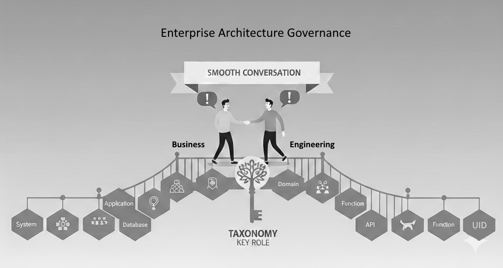

# Taxonomy 

## The [Core](taxonomy_core.md)

> Taxonomy shape is a two-level hierarchy.
>
> 
>
>
> - **Categories** — the four first-level nodes
> - **Capabilities** — the four second-level nodes within each Category
>
> The definitive hierarchy and terminology are maintained in [taxonomy_core.md](taxonomy_core.md).
> This document explains the taxonomy — it does not redefine its core.

> **Note**
> Taxonomy is necessary precondition and knowledge to start "climbing" the [CMM Levels](cmm.md#levels-and-characteristics)
{: .note}

# Enterprise Taxonomy

## What is a Enterprise Taxonomy?

Enterprise Taxonomy is a hierarchical classification structure for an commerical enterprise (aka organization) information space. It serves as:

- A **positioning system** — locating any concern within the organization's information space
- A **communication aid** — providing shared vocabulary across disciplines and roles
- A **governance foundation** — enabling consistent cataloguing, discovery, and reuse of knowledge

The Enterprise Taxonomy applies this concept to the Enterprise Domain. Its terminology is technology-neutral and applicable across business activities, roles, and deliverables.

Enterprise Taxonomy is key communication asset of the Enteprise

## Enterprise Taxonomy Terminology

Each Category together with its Capabilities forms a complete category definition. The four Categories are ordered by level of abstraction, from highest on the top to lowest on the bottom.

Root of the hierarchy tree is thus top-left positioned.

> **Important**
> All node names in the hierarchy are official terminology — to be used company wide with no changes or reinterpretations. See [taxonomy_core.md](taxonomy_core.md) for the authoritative hierarchy.
{: .important}

---

### Category: Conceptual

High-level blueprint: business goals, information domains, application functions, and technology choices. Establishes alignment with business objectives and shared understanding among stakeholders.

**Capabilities**

- **Business** — Business goals and objectives; alignment of systems with organizational strategy and desired outcomes.
- **Information** — Data structures and relationships the organization needs; how information is organized to serve business processes.
- **Application** — Functions and features delivered to users: interfaces, processing, reporting.
- **Technology** — Underlying technologies selected to build and operate systems: languages, databases, platforms.

---

### Category: Logical

Detailed design: how components interact, how data is managed, how systems integrate, and how they are secured. Bridges conceptual intent and physical reality.

**Capabilities**

- **Data Management** — How data is stored, accessed, and governed across systems.
- **Integration** — How systems communicate and exchange information with each other.
- **Platform** — The software environment and runtime infrastructure on which systems operate.
- **Security** — Measures protecting systems and data from unauthorized access and threats; compliance with standards.

---

### Category: Physical

Tangible resources: hardware, infrastructure, connectivity, and storage. Ensures a stable, scalable environment for reliable processing and data exchange.

**Capabilities**

- **Compute** — Processing resources: servers, processors, virtual machines.
- **Infrastructure** — Physical and virtual environment: data centres, hosting, environmental support.
- **Network** — Communication pathways connecting components and users.
- **Storage** — Devices and strategies for persisting and retrieving data.

---

### Category: Implementation

Processes and practices for building, delivering, and sustaining systems. The lower in the taxonomy, the more engineering roles participate — but architectural decisions on structure and boundaries remain at every level.

**Capabilities**

- **Deployment** — Installing and configuring systems in target environments; transition from development to production.
- **Development** — Designing, coding, and testing; transforming requirements into working systems.
- **Monitoring** — Tracking performance and health after deployment; identifying and resolving issues.
- **Operations** — Ongoing management: updates, backups, incident response, and continuous improvement.

---

## Capabilities

In the context of Enteprise Taxonomy, Cabilities have two assets.

>
> Quick Definitions of two facets of capabilities
> 
> 1. Taxonomy Capability (Structural): a named classification node — fixed, structural, defined by [taxonomy_core.md](taxonomy_core.md).
>
> 2. Organizational Capability: the measurable ability to staff and execute within that node — variable, evolving, and the basis for enterprise KPIs.

### Capability as Taxonomy Term

The taxonomy defines sixteen **Structural Capabilities** — the named second-level nodes within each Taxonomy Category. These are structural: they name *what matters* in the organization's information space. They do not change with staffing, maturity, or time.

> **Tip**
> Capabilities named on the Taxonomy are "slots". It does not measure how well they are filled. That is the duty of Organization.
{: .tip}

### Capability as Organizational Ability

An organization develops and maintains its actual capability within each of those named slots. This is measurable: can the organization staff, execute, and deliver within a given Capability?

The taxonomy names sixteen Capabilities. The organization's maturity is reflected in how effectively it performs across them. These are the enterprise KPIs (Key Performance Indicators).

### Roles and Actors

Each staff member holds a Role — such as Product Owner, Enterprise Architect, Business Analyst, or Stakeholder. Role names are organizational; they do not mirror Capability names. A group of Actors (staff members sharing a Role) collectively own the organization's ability to perform within one or more Capabilities.

Actors are not always humans. At different levels of abstraction — or from different Points of View (POV) — an Actor may be a system, a service, or an automated process.

*Example: An Enterprise Architect and a Business Analyst both operate within the "Business" Capability of the "Conceptual" Category — one defines the structure, the other elaborates the requirements. The Role names differ; the Capability they serve is the same.*

