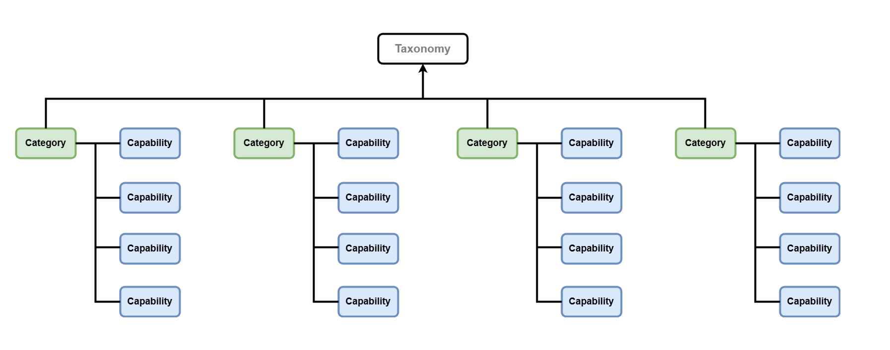

> **Important**
> This document is single source of truth.
>
> It contains the taxonomy hierarchy and the terminology defined by it.
>
> These definitions are to be used company wide, with no changes or reinterpretations.
{: .important}

# Taxonomy Shape

And Taxonomy meta-data: the meaning of the nodes in regards to their position in the hierachy



Taxonomy Meta Data defines only two elements

1. Category
   1. Four Categories total
2. Capability
   1. Each Category has total four offspring nodes: Capabilities

# Enterprise Taxonomy

Meta data elements are given names to define the Taxonomy in the context of an commercial exnteprise based on IT.

```text
├── Conceptual
│   ├── Business
│   ├── Information
│   ├── Application
│   └── Technology
├── Logical
│   ├── Data Management
│   ├── Integration
│   ├── Platform
│   └── Security
├── Physical
│   ├── Compute
│   ├── Infrastructure
│   ├── Network
│   └── Storage
└── Implementation
    ├── Deployment
    ├── Development
    ├── Monitoring
    └── Operations
```

> **Warning**
> Names of the nodes on the Taxonomy hierarchy are official Enterprise Terminology.
{: .warning}

<details markdown="1">
<summary><b>Commercial Enterprise Context</b></summary>


</details>